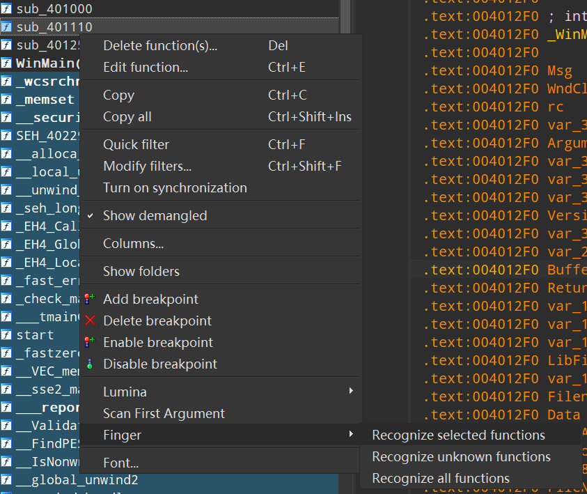
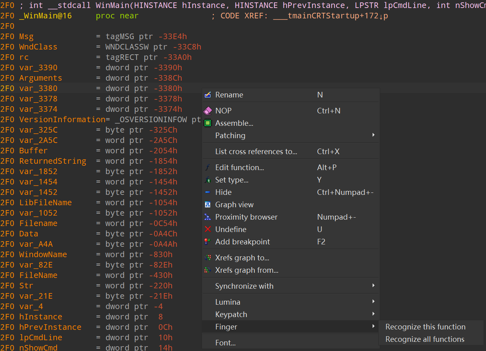
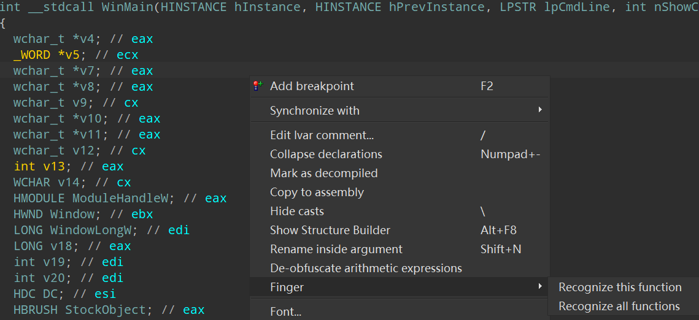

# Finger

An IDA Pro plugin to recognize function symbols online.

**Original author**: [aliyunav](https://github.com/aliyunav)

**Original source**: [GitHub Repository](https://github.com/aliyunav/Finger)

---

### Prerequisites

Before installing Finger, make sure you have the following:

1. **Python 2.7** or **Python 3** (version must match your IDAPython version).
2. **IDA Pro** version **7.0** or higher.
3. Install the `finger_sdk` package:

   ```bash
   pip install finger_sdk
   ```

---

### Installation

1. Verify that all prerequisites are met.
2. Download the `finger_plugin.py` file from the repository.
3. Place the file in the following directory:

   ```
   path/to/your/ida/plugins
   ```

---

### Usage

1. You may right-click the functions to recognize them.



2. You can also right-click in the disassembly or pseudocode window.





---

### Notes

- "Unknown functions" refers to those starting with "sub_".
- The recognized function symbols will **NOT** be highlighted in the **disassembly window** and **function window**. You can uncomment the relative codes and change the color yourself.

---

## License

GNU General Public License v3.0
